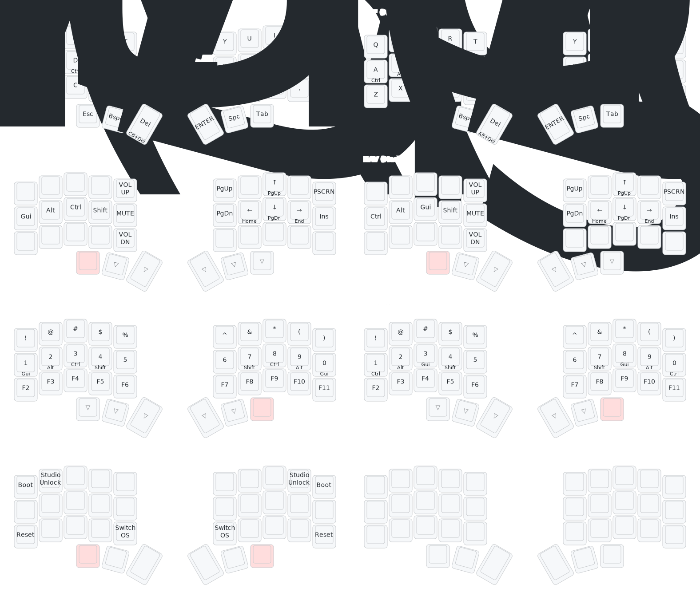
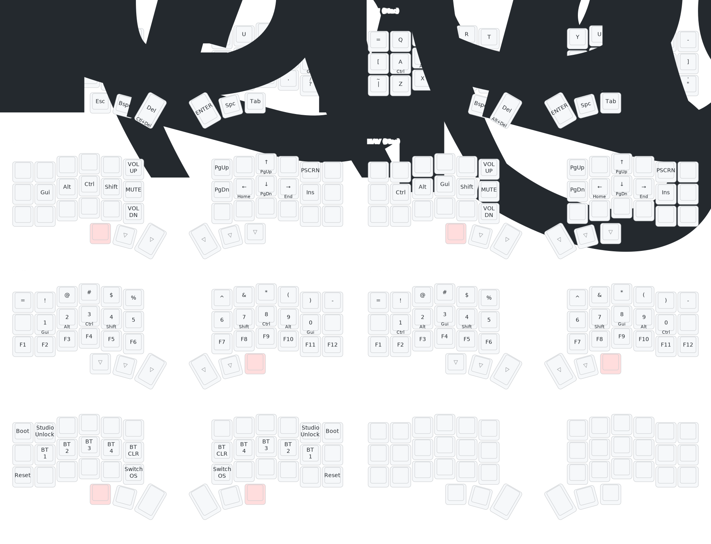

# zmk-config

[](https://zmk.dev/)
[](https://github.com/urob/zmk-helpers)
[](https://nixos.org/)
[](https://just.systems/)

A personal ZMK (Zephyr Mechanical Keyboard) firmware configuration repository
for building custom keyboard firmware. This setup supports multiple keyboards
(e.g., Cheapino v2, Ergonaut One) with features like OS-aware home row
modifiers, platform-optimized navigation, and automated visual keymap diagrams.

The development environment is streamlined using Nix for reproducible isolation,
direnv for automatic environment activation, and Just for task automation. It
includes declarative build matrices in `build.yaml` and automated keymap drawing
with keymap-drawer.

## Table of Contents

- [⌨️ Keymaps](#keymaps)
- [🛠️ Features](#features)
- [🚀 Installation](#installation)
- [📖 Usage](#usage)
- [🤖 GitHub Actions](#github-actions)
- [🎨 Customization](#customization)
- [📚 Glossary](#glossary)
- [🤝 Contributing](#contributing)
- [📄 License](#license)

<a name="keymaps"></a>

## ⌨️ Keymaps

Generated diagrams (via `just draw`) for the keyboards currently configured in
this repo:

| Keyboard                                              | Description                                   | Keymap Diagram                                                                                                                 |
| ----------------------------------------------------- | --------------------------------------------- | ------------------------------------------------------------------------------------------------------------------------------ |
| **[Cheapino v2](https://github.com/tompi/cheapino)**  | nice_nano_v2 shield                           | <a href="keymap-drawer/cheapinov2.svg"></a>      |
| **[Ergonaut One](https://github.com/ergonautkb/one)** | seeeduino_xiao_ble shield (left/right halves) | <a href="keymap-drawer/ergonaut_one.svg"></a> |

## 🛠️ Features

- **Cross-Platform Support**: Separate layers for Windows and macOS with
  OS-specific shortcuts and behaviors.
- **Home Row Modifiers**: Ergonomic modifier placement for efficient typing.
- **Navigation Layers**: Dedicated layers for mouse and arrow key navigation.
- **Number Layers**: Quick access to numbers and function keys.
- **Visual Keymap Diagrams**: Automatically generated SVG diagrams using
  keymap-drawer.
- **Reproducible Environment**: Nix-based setup ensures consistent development
  across machines.
- **Automated Builds**: Declarative build matrix in `build.yaml` for easy
  firmware generation.

<a name="installation"></a>

## 🚀 Installation

### Prerequisites

- [Nix](https://nixos.org/download.html) with flakes enabled
- [direnv](https://direnv.net/) for automatic environment activation
- Git

### Setup

1. Clone the repository:

   ```bash
   git clone https://github.com/kaiiiiiiiii/zmk-config.git
   cd zmk-config
   ```

2. Allow direnv to load the environment:

   ```bash
   direnv allow
   ```

3. Initialize the Zephyr workspace:
   ```bash
   just init
   ```

This will set up the Nix environment, install dependencies, and initialize the
Zephyr workspace.

<a name="usage"></a>

## 📖 Usage

### Justfile Commands

The `Justfile` provides a set of commands to manage the build, test, and
visualization process. Here's how everything works:

#### Core Commands

- `just init`: Initialize Zephyr workspace (west init + update + export).
- `just list`: Show all build target tuples derived from `build.yaml`.
- `just build <expr>`: Filter targets (case-insensitive substring match; `all`
  expands). Builds firmware artifacts to `firmware/`.
- `just draw [targets...]`: Generate visual keymap diagrams. No args or `all` →
  all known targets.
- `just clean`: Clean build artifacts.
- `just clean-all`: Clean everything including Zephyr modules.

#### Build Workflow

The build process uses `build.yaml` as a declarative matrix:

```yaml
# Example build.yaml
builds:
  - board: nice_nano_v2
    shield: cheapinov2
    artifact-name: cheapino-v2
  - board: seeeduino_xiao_ble
    shield: ergonaut_one_left
  - board: seeeduino_xiao_ble
    shield: ergonaut_one_right
```

Internals:

- `_parse_targets`: Parses `build.yaml` using `yq` to generate build tuples.
- `_build_single`: Invokes `west build` with appropriate flags and copies
  artifacts.

#### Drawing Keymaps

Keymap drawing pipeline:

1. Parse keymap with `keymap parse` (includes virtual layers like Combos).
2. Post-process combos layer using `yq`.
3. Render with `keymap draw` to produce YAML and SVG files.

Metadata for layouts and keyboards is defined in the `Justfile`:

```bash
LAYOUTS["cheapinov2"]="config/boards/shields/cheapinov2/cheapinov2-layout.dtsi"
KEYBOARDS["cheapinov2"]="config/boards/shields/cheapinov2/cheapinov2.zmk.yml"
```

### Example Workflows

Build all targets:

```bash
just build all -p  # Pristine build
```

Build specific keyboard:

```bash
just build cheapinov2
```

Draw keymaps:

```bash
just draw cheapinov2 ergonaut_one
```

<a name="github-actions"></a>

## 🤖 GitHub Actions

This repository includes GitHub Actions for automated building:

### Build Firmware

- **Trigger**: Push to main or pull requests
- **Workflow**: `build.yml`
- **Actions**:
  - Sets up Nix environment
  - Builds firmware for all targets in `build.yaml`
  - Uploads artifacts

To use GitHub Actions, ensure your repository has the necessary secrets and that
Nix is available in the runner environment.

<a name="customization"></a>

## 🎨 Customization

### Adding a New Keyboard

1. Add entry to `build.yaml`:

   ```yaml
   - board: <board>
     shield: <shield>
     snippet: <optional>
     artifact-name: <optional>
   ```

2. Create shield configuration in `config/boards/shields/<shield>/`
3. Update `Justfile` with layout and keyboard metadata
4. Run `just build <shield>` to test

### Modifying Keymaps

Edit the keymap files in `config/`:

- `base.keymap`: Common behaviors
- `<keyboard>.keymap`: Keyboard-specific layers

Use ZMK documentation for keycode references.

### Environment Customization

Modify `flake.nix` to add dependencies or change versions.

<a name="glossary"></a>

## 📚 Glossary

- **ZMK**: Zephyr Mechanical Keyboard firmware
- **West**: Zephyr's meta-tool for managing workspaces
- **Shield**: ZMK term for keyboard-specific configurations
- **Layer**: A set of key bindings that can be activated
- **Home Row Modifiers**: Modifiers placed on the home row for ergonomic access
- **Nix Flake**: A declarative way to define Nix environments
- **Direnv**: Tool for loading/unloading environment variables based on
  directory
- **Just**: Command runner for saving and running project-specific commands

<a name="contributing"></a>

## 🤝 Contributing

1. Fork the repository
2. Create a feature branch
3. Make your changes
4. Submit a pull request

Please follow the established patterns in the codebase and update documentation
as needed.

<a name="license"></a>

## 📄 License

This project is licensed under the Apache License 2.0. See the
[`LICENSE`](./LICENSE) file for full terms.

Note on third‑party code & packages:

- Nix flakes in `inputs` (e.g. `nixpkgs`) and any packages you build or
  distribute through this configuration are covered by their own upstream
  licenses.
- Refer to `nixpkgs` package metadata (`meta.license`) or upstream project
  repositories for details before redistributing binaries.
- Nothing in this repository alters or supersedes those third‑party licenses;
  the Apache 2.0 terms apply only to the original material contained here.

If you contribute, you agree your contributions are provided under Apache 2.0
unless explicitly stated otherwise.

---

_Made with ❤️ for mechanical keyboards_

_Special thanks to [Urob](https://github.com/urob) and
[zmk-helpers](https://github.com/urob/zmk-helpers) for inspiration and amazing
ZMK modules._
